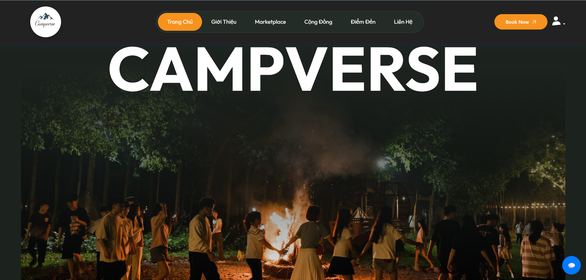
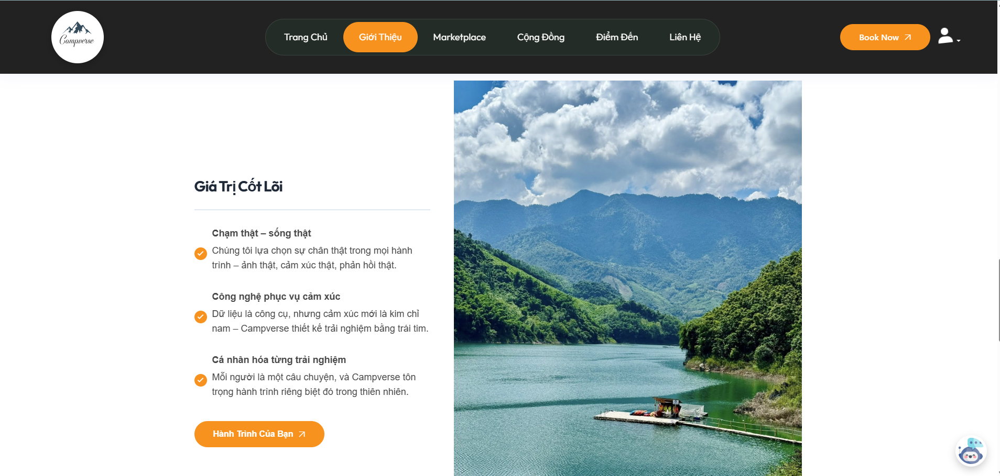
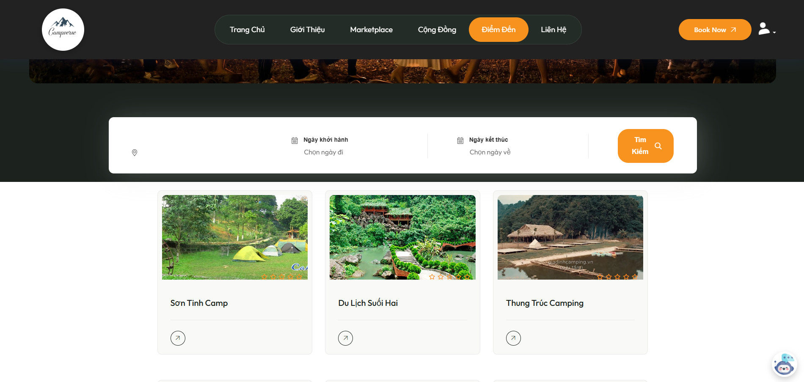
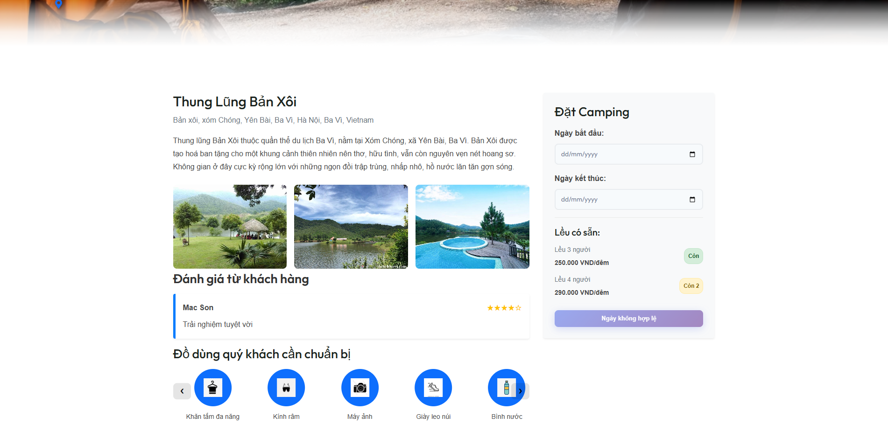
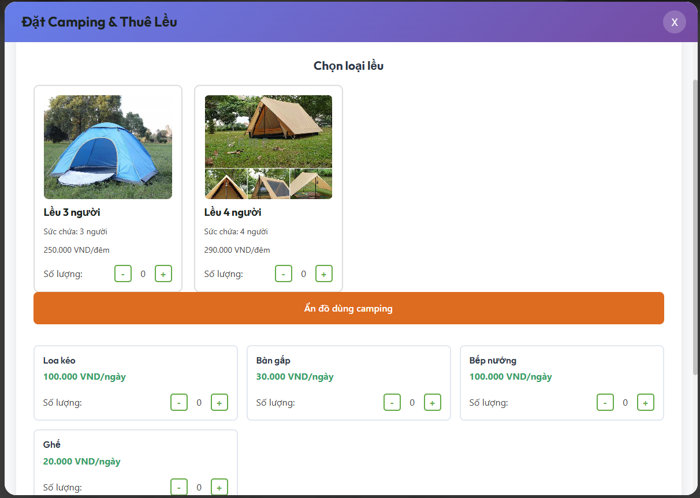
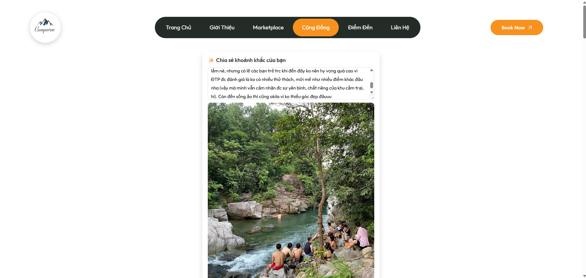

# 🏝️ CAMPVERSE – Nền tảng tìm kiếm, đánh giá & đặt chỗ du lịch

CAMPVERSE là website cho phép người dùng **tìm kiếm địa điểm du lịch**, **đặt chỗ**, **đánh giá**, và **chia sẻ trải nghiệm** với cộng đồng. README này mô tả đầy đủ tính năng, kiến trúc và demo hình ảnh giống như style bạn gửi (VHome).

---

# 🖼️ Giao diện Website

### 🏠 **Trang Home – Khám phá địa điểm**

### 🗺️ **Trang Giới thiệu**

### 🔍 **Trang tìm kiếm & lọc địa điểm**

### 📄 **Trang chi tiết khu du lịch**

### 🗓️ **Trang đặt lịch**

### 💳 **Trang thanh toán**

### 📝 **Trang bài viết trải nghiệm người dùng**

# ✨ Mục tiêu dự án

Xây dựng một nền tảng hỗ trợ người dùng **lên kế hoạch du lịch hiệu quả**, chọn đúng nơi, đúng giá, đúng trải nghiệm – thông qua thông tin minh bạch, đánh giá thật và cộng đồng chia sẻ.

---

# 🚀 Tính năng nổi bật

### 🔍 **Tìm kiếm linh hoạt**

* Tìm theo tên, địa điểm, tỉnh/thành
* Bộ lọc: giá, đánh giá, loại hình du lịch, tiện nghi

### ⭐ **Đánh giá & xếp hạng**

* Rating theo sao
* Review có hình ảnh
* Hệ thống phân loại đánh giá theo chủ đề (dịch vụ, vệ sinh, vị trí…)

### 🏨 **Đặt chỗ trực tuyến**

* Chọn ngày – chọn loại phòng – đặt chỗ
* Gợi ý theo ngân sách

### 📝 **Đăng tải bài trải nghiệm**

* Upload hình ảnh
* Tag địa điểm liên quan
* Chia sẻ review dạng blog

### ❤️😂👍 **Thả cảm xúc & bình luận**

* 6 loại cảm xúc
* Comment dạng luồng (thread)
* Nhận thông báo tương tác

### 👤 **Tài khoản người dùng**

* Đăng ký / đăng nhập (Email, Google)
* Hồ sơ cá nhân
* Lưu danh sách địa điểm yêu thích

# 🛠 Công nghệ sử dụng

### 🌐 **Frontend**

* ReactJS / Next.js
* TailwindCSS
* Redux Toolkit

### 🧠 **Backend chính**

* Spring Boot
* MySql
* JWT Authentication

### ☁️ **DevOps**

* VPS Ubuntu 22.04
* Docker
* Nginx reverse proxy
* PM2

